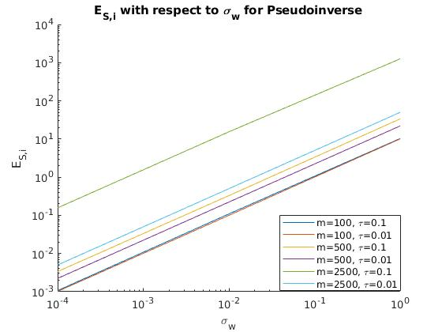
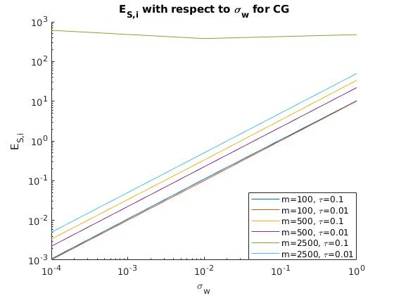

Umur Gogebakan

Bilkent University

21702705

CS

* * * * *
Problem
=======

We want to solve system of linear equations that has a major application
area in all mathematics and engineering:

Here, many issues arise as the size, sparsity, shape etc. of A changes
when we try to solve this system on a computer where we have only finite
precision arithmetic.

One easy approach is simply doing a Gaussian elimination which
corresponds to LU factorization. Yet, when A is large this method
becomes infeasible. Moreover, if A has special properties such as being
sparse, symmetric etc. these properties can be exploited for an
efficient computation of the vector x.

Here, we used three methods where two of them (GMRES and CG) are
iterative and the other one is not (Pseudoinverse). The other one
(MINRES) is approached as a special case of GMRES when A is symmetric.

* * * * *

Algorithms for the Solution
===========================

Pseudoinverse ()
--------------------------------------

Let  be the solution found for the equation,

Then  can be represented as the minimum
 that minimized the residual sum of squares:

This yields: ; let us call
as pseudoinverse of A where:

So that:

In order to find pseudoinverse of A in all cases we have to apply SVD,
which yields:

### Code

1function [A\_psuedo] = psuedo\_inverse(A)

2        [U,S,V] = svd(A);

3        A\_psuedo = V \* transpose(diag(1 ./ (S\*ones(size(S, 1),1))))
\* transpose(U);

4end

* * * * *

Figure 1: ES,i values with respect to sigma for Pseudoinverse algorithm
where size m ∈ {100, 500, 2500} and τ ∈ {0.1, 0.01}; x and y axis are
log scaled.

### Comment

Figure 1 indicates that as the noise (σ) increases, error ES,i also
increases. The trend also indicates that error is less for small tau
values than for the case with tau being larger (smaller tau means matrix
is more sparse and positive-definiteness). Especially for the matrix A
being size of 2500 with large tau, error is significantly high. This is
due to the singularity and condition of the matrix. This concludes that
for relatively small matrices tau is not that effective on the result,
yet for large matrices alteration becomes significant.

* * * * *

Conjugate Gradients (CG)
------------------------

The conjugate gradient method is using the original Krylov subspace
iteration to reach the result x. This algorithm converges significantly
fast and stays at the heart of computation when the matrix A is
symmetric positive definite. The main different motivation behind the CG
is the exploitation of the Hessenberg matrix and measuring A-norm is
very appropriate to measure the error after each iteration.

### [1]

The code below is the implementation of this algorithm with added
stopping criterion:

* * * * *

### Code 

 1function [x\_n, i, error] = CG(A, b, maximum\_iteration\_number, tol)

 2        x\_n = 0;

 3        r\_n = b;

 4        r\_n = b;

 5        p\_n = r\_n;

 6        error = zeros(1, maximum\_iteration\_number);

 7        for i = 1:maximum\_iteration\_number

 8                %update

 9                r\_n\_prev = r\_n;

10                p\_n\_prev = p\_n;

11                x\_n\_prev = x\_n;

12                %

13                alpha\_n =
(transpose(r\_n\_prev)\*r\_n\_prev)/(transpose(p\_n\_prev)\*A\*p\_n\_prev);

14                x\_n = x\_n\_prev + alpha\_n\*p\_n\_prev;

15                r\_n = r\_n\_prev - alpha\_n\*A\*p\_n\_prev;

16                error(i) = norm(b-A\*x\_n)\^2;

17                if norm(r\_n) \< tol

18                        return

19                end

20                beta\_n =
(transpose(r\_n)\*r\_n)/(transpose(r\_n\_prev)\*r\_n\_prev);

21                p\_n = r\_n + beta\_n\*p\_n\_prev;

22        end

23end     

Figure 2: ES,i values with respect to sigma for CG algorithm where size
m ∈ {100, 500, 2500} and τ ∈ {0.1, 0.01}; x and y axis are log scaled.

### Comment 

Figure 2 indicates that error ES,i increases as noise increases. Similar
to Figure 1 for the case where size is 2500 and tau is 0.1, error is
exceptionally high and does not have a decreasing fashion. This is
because of the fact that the matrix is not positive definite. Sparsity
is also another issue. When m is isolated, smaller the tau smaller the
error we observe. This is because of the sparsity of the matrix and
especially for small matrices we see that sparsity and positive
definiteness properties are highly exploited by the CG algorithm. And
again similar to Figure 1, for small matrices tau seems to be less
effective when it is compared to matrices with larger size. Finally, the
error graph we observe here seems similar to the graph for
Pseudoinverse, this algorithm computes the answer in a much faster way.

* * * * *

Generalized Minimum Residual (GMRES) 
------------------------------------

The idea of GMRES is, at step n to approximate x\* by the vector
xn ∈ Кn that minimizes the norm residual rn = b - Axn.

Here, we use Arnoldi iterations to construct a sequence of Krylov
matrices Qn whose columns q1, q2, q3, … span the successive Krylov
subspaces Кn.

So;

[2]

Here, finding the minimizing y can be done by using QR factorization for
solving least squares:

Then it follows,

### [3]

The code below is the implementation of this algorithm with added
stopping criterion:

Here, the built-in MATLAB function (qr) is used to find the QR
factorization. One can exploit the Hessenberg structure by using Givens
rotations to produce orthonormal bases. Yet, it is not implemented as it
is not covered in class and not asked for.

* * * * *

### Code 

 1function [x, n, error] = GMRES(A, b, maximum\_iteration\_number, tol)

 2            %initial arbitrary vector q\_0

 3           q\_1 = b / norm(b);

 4           n = length(A);

 5          H\_tilda = zeros(n+1, n);

 6         Q = zeros(length(q\_1), n+1);

 7         e\_1 = zeros(n+1, 1);

 8        e\_1(1,1) = 1;

 9         x = 0;

 10        Q(:,1) = q\_1;

 11        error = zeros(1, maximum\_iteration\_number);

 12        for n = 1:maximum\_iteration\_number

 13                 %step n of arnoldi iteration

 14                %v = A\*q\_n;

 15                v = A\*Q(:,n);

 16                for j=1:n

 17                        %h\_j\_n = q\_j' \* v;

 18                        H\_tilda(j,n) = Q(:,j)' \* v;

 19                        %v = v - h\_j\_n \* q\_j;

 20                        v = v - H\_tilda(j,n) \* Q(:,j);

 21                end

 22                %h\_n\_next\_n = norm(v);

 23                H\_tilda(n+1,n) = norm(v);

 24                %q\_n\_next = v / h\_n\_next\_n;

 25                Q(:,n+1) = v / H\_tilda(n+1,n);

 26                %end of step n of Arnoldi iteration

 27                %find y to minimize ||r\_n|| using QR

 28                [Q\_r, R] = qr(H\_tilda(1:n+1, 1:n));

 29                d = Q\_r' \* (norm(b)\*e\_1(1:n+1));

 30                y = R\\d;

 31                x = Q(:, 1:n)\*y;

 32                error(n) = norm(A\*x - b);

 33                if error(n) \< tol

 34                        return

 35                end

 36        end

 37end

* * * * *

Figure 3: ES,i values with respect to sigma for GMRES algorithm where
size m ∈ {100, 500, 2500} and τ ∈ {0.1, 0.01}; x and y axis are log
scaled.

### Comment

According to Figure 3, error ES,i increases with the noise level. For
the case where the size of matrix is 2500 and tau is 0.1, error is
significantly high when it is compared to other cases. This is due to
the less sparse structure and not being a positive definite property of
the matrix. These factors result in the matrix being ill-conditioned and
make it unstable close to being a singular matrix. However, unlike the
CG algorithm we see that the increase in error for the largest matrix
decreases after sigma = 0.01 and makes a breaking point in terms of its
gradient at sigma = 0.01. Moreover, the starting error for the large
matrix is less than CG. Therefore, even if the error for the large
matrix with sigma = 0.01 is significantly high, this difference becomes
insignificant as we go along with the sigma positive direction. This due
to the fact that although matrix condition and stability of matrix is
the reason for this error, GMRES does not require matrix to be positive
definite and that is the reason why when sigma = 1, all algorithms
gather at a single close value. Again, small tau valued matrices have
less error compared to ones with larger tau, due to the sparsity and
relatively well-conditioning. For small matrices, tau value is not that
effective but for the large ones its effect is explicitly observable.
This concludes that the plot is similar to Pseudoinverse case excluding
the largest case with tau being largest, but GMRES being much faster in
terms of computation time.

* * * * *

Minimum Residual (MINRES) 
-------------------------

MINRES can be taught of special case variation of GMRES as the names
suggest, to be used when A is symmetric. Because of the symmetric
structure of the Hessenberg matrix, the Hessenberg structure obtained is
actually tridiagonal. So Arnoldi iteration can be replaced by Lanczos
iteration that uses only qn-1 and qn for the computation of qn+1. That
removes the nested inner second for loop and achieves better
computational efficiency.

### [4]

The code below is the implementation of Lanczos based MINRES algorithm
with added stopping criterion:

Here, the built-in MATLAB function (qr) is used to find the QR
factorization. One can exploit the Hessenberg structure by using Givens
rotations to produce orthonormal bases. Yet, it is not implemented as it
is not covered in class and not asked for.

* * * * *

### Code

  1function [x, n, error] = MINRES(A, b, maximum\_iteration\_number,
tol)

  2            %initial arbitrary vector q\_0

  3           q\_0 = 0;

  4          q\_n = q\_0;

  5         q\_1 = b / norm(b);

  6          beta\_0 = 0;

  7           beta\_n = beta\_0;

  8          n = length(A);

  9           Q = zeros(length(q\_1), n+1);

10           T\_tilda = zeros(n+1, n);

11           e\_1 = zeros(n+1, 1);

12            e\_1(1,1) = 1;

13            x = 0;

14           Q(:,1) = q\_1;

15           error = zeros(1, maximum\_iteration\_number);

16           for n = 1:maximum\_iteration\_number

17                       beta\_n\_prev = beta\_n;

18                       q\_n\_prev = q\_n;

19                       %Lancsoz step

20                      %v = Aqn

21                       v = A\*Q(:,n);

22                      alpha\_n = Q(:,n)'\*v;

23                      v = v
- beta\_n\_prev\*q\_n\_prev-alpha\_n\*Q(:,n);

24                beta\_n = norm(v);

25                Q(:,n+1) = v/beta\_n;

26                T\_tilda(n,n) = alpha\_n;

27                T\_tilda(n+1,n) = beta\_n;

28                T\_tilda(n,n+1) = beta\_n;

29                %end of step n of Lanczos iteration       

30                %find y to minimize ||r\_n|| using QR

31                [Q\_r, R] = qr(T\_tilda(1:n+1, 1:n));

32                d = Q\_r' \* (norm(b)\*e\_1(1:n+1));

33                y = R\\d;        

34                       x = Q(:, 1:n)\*y;

35                error(n) = norm(A\*x - b);

36                if error(n) \< tol

37                            return

38                end

39                q\_n = Q(:,n);

39            end

40end

* * * * *

Figure 4: ES,i values with respect to sigma for MINRES algorithm where
size m ∈ {100, 500, 2500} and τ ∈ {0.1, 0.01}; x and y axis are log
scaled.

### Comment

Please refer to Comment section of Figure 3 as Figure 4
is indistinguishably similar.

* * * * *

Detailed Analysis of CG 
-----------------------

### Stopping Criterion

Norm of the residual is used for the stopping criterion which is:

Orthogonality of q vectors which span the Krylov subspaces can be chosen
as another metric for the stopping criterion. Yet, since we do not have
to store these vectors this criterion is preferable.

As the following Figures 5-13 suggests, continuing iteration after the
convergence is meaningless and may start to become numerically unstable
to the machine epsilon as the orthogonality ()
may deviate (same applies to the GMRES). The algorithm converges very
fast if the matrix A is positive definite and well-conditioned. Yet,
also the Figures 11-13 shows that convergence does not always have to
take place due to the matrix A being not positive definite and
ill-conditioned.

### Error Metric 

* * * * *

Figure 5: EO,i values with respect to n iterations for CG algorithm
where size m = 100, σ = 0.0001 and τ ∈ {0.1, 0.01}; x and y axis are log
scaled.

Figure 6: EO,i values with respect to n iterations for CG algorithm
where size m = 100, σ = 0.01 and τ ∈ {0.1, 0.01}; x and y axis are log
scaled.

Figure 7: EO,i values with respect to n iterations for CG algorithm
where size m = 100, σ = 1 and τ ∈ {0.1, 0.01}; x and y axis are log
scaled.

### Comment

As it can be seen from the Figures 5-7, noise level does not have a
significant effect on convergence of CG whereas tau has. For tau = 0.01,
the algorithm converges faster and reaches around machine epsilon before
the 10th iteration. Yet, for tau = 0.1, the algorithm reaches machine
epsilon around the 20th iteration. However, it is still an important
conclusion that for both tau values and different sigma values the
algorithm succeeds to minimize the residual and converge to the desired
solution.

Figure 8: EO,i values with respect to n iterations for CG algorithm
where size m = 500, σ = 0.0001 and τ ∈ {0.1, 0.01}; x and y axis are log
scaled.

Figure 9: EO,i values with respect to n iterations for CG algorithm
where size m = 500, σ = 0.01 and τ ∈ {0.1, 0.01}; x and y axis are log
scaled.

Figure 10: EO,i values with respect to n iterations for CG algorithm
where size m = 500, σ = 1 and τ ∈ {0.1, 0.01}; x and y axis are log
scaled.

### Comment

Figures 8-10, shows us that as the size of matrix m increases from 100
to 500, convergence occurs in later iterations. The red line showing the
convergence of the case where tau = 0.01 is very similar to Fİgures 5-7
but moved a bit further in the positive x direction. So the convergence
still occurs before the 10th iteration but later than the case where m
was 100, being close to the 9th iteration. The blue line indicating the
convergence where tau = 0.1, is more horizontal and has a smaller
gradient compared to the Figures 5-7. This indicates that for m = 500,
larger tau is more affected by the size and convergence slows down. Yet,
it is still an important observation that  both lines are decreasing and
have a converging trend. Again, noise seems to be not affecting the
results significantly.

Figure 11: EO,i values with respect to n iterations for CG algorithm
where size m = 2500, σ = 0.0001 and τ ∈ {0.1, 0.01}; x and y axis are
log scaled.

Figure 12: EO,i values with respect to n iterations for CG algorithm
where size m = 2500, σ = 0.01 and τ ∈ {0.1, 0.01}; x and y axis are log
scaled.

Figure 13: EO,i values with respect to n iterations for CG algorithm
where size m = 2500, σ = 1 and τ ∈ {0.1, 0.01}; x and y axis are log
scaled.

### Comment

As Figures 11-13 suggests, when matrix size m is 2500 the convergence
line for tau = 0.01 is even moved to further along positive x direction.
It exceeds the 10th iteration. And the most significant and important
conclusion that can be drawn from Figures 11-13 is the case where tau =
0.1. As the blue line suggests in all three graphs, when the matrix size
is 2500 and tau is 0.1, the CG algorithm does not converge due to the
ill conditioning and not being positive definite property of the matrix.
Noise level seems to not affect the result that much when tau = 0.01.
Yet, it has some observable effects on the shape of the graph for the
case when tau = 0.1, whereas the change does not have a meaningful
interpretation as for all noise levels the algorithm does not converge
when tau is large.

All these comments are adherent with the literature, stating that CG is
a powerful and important method. However, it is not always the case that
matrices possibly arising in practice have this kind of well-behaved
spectrum as Figures 11-13 suggests.

* * * * *

[[1]](#ftnt_ref1) Trefethen, L. N., & Bau, D. I. (2000). The Conjugate
Gradient Iteration. In Numerical Linear algebra. Philadelphia: SIAM
Society for Industrial and Applied Mathematics.
doi:https://mseas.mit.edu/group/References/Books/Trefethen\_Bau%20-%20Numerical%20Linear%20Algebra.pdf

[[2]](#ftnt_ref2) Ibid, GMRES.

[[3]](#ftnt_ref3) Ibid, Arnoldi Iteration.

[[4]](#ftnt_ref4) Ibid, Lanczos Iteration.
